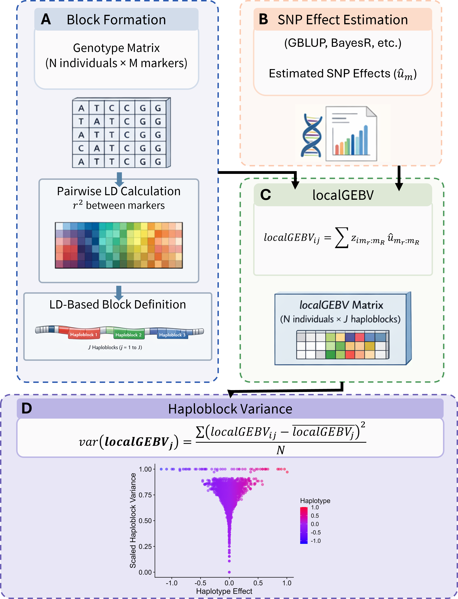

# HapSelect

HapSelect is an R package for haplotype-based genomic selection. It partitions the genome into linkage disequilibrium blocks (haploblocks), estimates per-block breeding value contributions (localGEBV), uses a genetic algorithm to select parents that maximise coverage of high-value haplotype alleles, and runs a basic simulation comparing genetic algorithm parents to truncation selection over time.



## Workflow at a glance

| Stage | What it does | Key function |
|-------|-------------|--------------|
| Pairwise LD | Compute r² between all marker pairs | `pairwise_ld()` / `plink_pairwise_ld()` |
| Haploblocking | Partition genome into LD-based haploblocks | `def_blocks()` |
| Genomic Prediction | Compute marker effects and prediction accuracy | `create_marker_effects_file()`, `cross_validation()` |
| LocalGEBV | Estimate per-block breeding value per individual | `compute_local_GEBV()` |
| Visualisation | Explore haploblock structure, localGEBV patterns | `plot_haploblocks()`, `plot_ld_decay()`, … |
| Parent selection | Optimise founder set using a genetic algorithm | `genetic_algorithm()` |
| Basic Simulation | Compare GA and TS parent performance over time | `GA_vs_TS_simulation()` |

For full documentation, workflow guides, and parameter details, see the **[HapSelect documentation site](https://wrshf7.github.io/HapSelect-Docs)**.

## Install

```r
install.packages("devtools")
devtools::install("path/to/unzipped/HapSelect")
```

> **Note:** [genomicSimulation](https://github.com/vllrs/genomicSimulation) and [RTools 4.5](https://cran.r-project.org/) must be installed separately. PLINK 1.9 is optional but recommended for LD computation. See the [installation guide](https://wrshf7.github.io/HapSelect-Docs/installation) for details.

## Run Example Workflow

```r
library(HapSelect)
source(system.file("examples", "example_workflow_minimal_comments.R", package = "HapSelect"))
```

## Contributing

For details on contributing to this package, see [the development guide](DEVELOPMENT.md).

## Authors

Will Shaffer, Victor Papin, Zane Carter

The University of Queensland